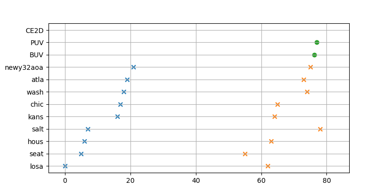
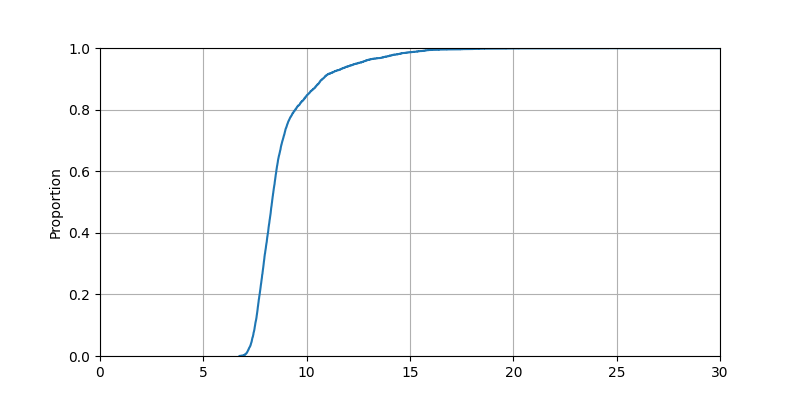

# Flash Artifact for SIGCOMM22 <!-- omit in toc -->

This branch contains the Flash artifact for the evaluations in SIGCOMM22 paper "Flash: Fast, Consistent Data Plane Verification for Large-Scale Network Settings".

**Table of Contents**
- [Environment setup](#environment-setup)
  - [Platform requirements](#platform-requirements)
  - [Get Flash artifact and datasets for evaluation](#get-flash-artifact-and-datasets-for-evaluation)
  - [Build Flash artifact and extract datasets](#build-flash-artifact-and-extract-datasets)
  - [Entrypoint](#entrypoint)
- [SIGCOMM22 Evaluations](#sigcomm22-evaluations)
  - [Effects of Fast IMT](#effects-of-fast-imt)
  - [Effects of CE2D](#effects-of-ce2d)
    - [CE2D on OpenR dataset](#ce2d-on-openr-dataset)
    - [Consistent loop detection on OpenR* dataset](#consistent-loop-detection-on-openr-dataset)
    - [Consistent Loop Detection on I2* dataset](#consistent-loop-detection-on-i2-dataset)
    - [All pair reachability check on LNet1 dataset](#all-pair-reachability-check-on-lnet1-dataset)
  - [Micro Benchmark](#micro-benchmark)

# Environment setup
## Platform requirements
To run the evaluations, the following platform and software suits are required:
* Hardware requirements: A server with 8+ CPU cores and 32GB+ memory is prefered
* Operating system: Ubuntu Server 20.04 (Other operating systems are untested, but should also work as long as the bellow software suits are avaliable)
* JDK 17
* Maven v3.8.5+
* Git v2.25.1+
* Python v3.6+

***Note***:

* Make sure `java` and `mvn` is added to your $PATH environment variable, so that the Flash build script can find them.
* Make sure `python3` is the default `python` interpreter.
  
## Get Flash artifact and datasets for evaluation

Flash artifact is publicly avaliable, clone the repo to any directory to get all required sources for evaluation.
```
$ git clone https://github.com/snlab/flash.git
```

The evaluations for SIGCOMM22 are in the branch **sigcomm22-artifact**, switch to the repo and checkout the branch.

```bash
$ cd flash
$ git checkout sigcomm22-artifact
```


## Build Flash artifact and extract datasets
> TODO: split dataset to another repo

To ease the evaluation process, we provide a build script to build Flash and prepare the datasets for evaluation.
```bash
$ ./build.sh
```
The `build.sh` script will install all necessary libraries, then build the java project, create a folder `dataset` and download all datasets for evaluation. 

## Entrypoint
The `./evaluator` file is the entrypoint for all evaluations, which takes an argument `-e` for the evaluation name.
```bash
$ ./evaluator -h
usage: evaluator.py [-h] -e EVALUATION [-o OUTPUT]

options:
  -h, --help     show this help message and exit
  -e EVALUATION  The EVALUATION to be run
  -o OUTPUT      The OUTPUT log file, default: tmp/log.txt
```

# SIGCOMM22 Evaluations

## Effects of Fast IMT
> TBD export MAVEN_OPTS="-Xmx4g -Dfile.encoding=UTF-8"
```bash
nohup java -Xmx28g -jar flash-public-1.0-SNAPSHOT-jar-with-dependencies.jar -e All >consoleMsg.log 2>&1 &
```

## Effects of CE2D
### CE2D on OpenR dataset

Run the evaluation:

Execute the following command to run the evaluation:
```bash
$ ./evaluator -e I2CE2D
```
Expected output:

The evaluation generates a scatter figuer in `output/I2CE2D.png` (Figure 7(a) in paper).



### Consistent loop detection on OpenR* dataset

Run the evaluation:

Execute the following command to run the evaluation:
```bash
$ ./evaluator -e I2EarlyDetection
```
Expected output:

The evaluation generates a CDF figuer in `output/I2EarlyDetection.png` (Figure 7(b) in paper).


### Consistent Loop Detection on I2* dataset

Run the evaluation:

Execute the following command to run the evaluation:
```bash
$ ./evaluator -e I2LongTail
```

Expected output:

The evaluation generates a CDF figuer in `output/I2LongTail{,1}.png` (Figure 7(c/d) in paper).


### All pair reachability check on LNet1 dataset

Run the evaluation:

Execute the following command to run the evaluation:
```bash
$ ./evaluator -e LNet1AllPair
```
Expected output:

The evaluation generates a CDF figuer in `output/LNet1AllPair.png` (Figure 8 in paper).




***Note***:
The CDF line of the above figure is smoother than the Figure 8 of the paper due to the code cleaning up. We'll update Figure 8 to the newer result.

## Micro Benchmark
> TBD